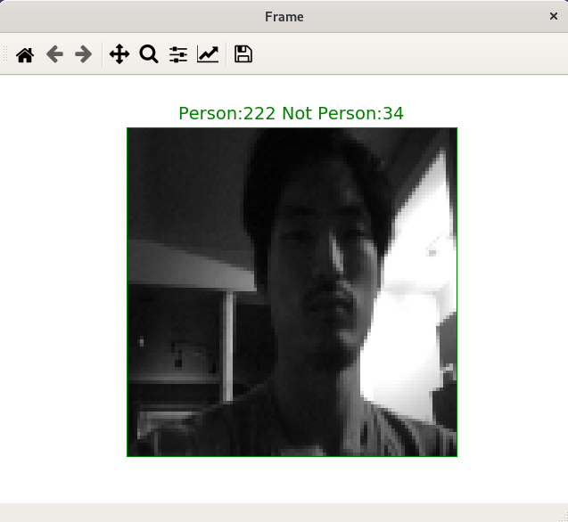
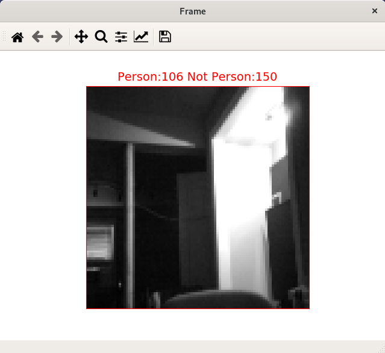

################
Person Detection
################

This example demonstrates how to integrate the xCORE FreeRTOS port with the TensorFlow person detection example application.  This application places the model in LPDDR.

The example uses an `ArduCam 2MP Plus OV2640 Mini Module SPI camera <https://www.arducam.com/product/arducam-2mp-spi-camera-b0067-arduino/>`__ to capture a 96x96 8 bit grayscale image.  The application will attempt to classify whether the image contains a person or does not contain a person.

When a person is detected LED 0 turns on.  When a person is not detected LED 0 turns off.  LED 3 toggles after each inference.  Additionally, a Python 3 script is provided to output image and output tensor pairs to the host machine.  This script requires `Numpy <https://numpy.org/>`__ and `Matplotlib <https://matplotlib.org/>`__.

**************
Hardware setup
**************

Materials Required
==================

- `ArduCam 2MP Plus OV2640 Mini Module SPI camera <https://www.arducam.com/product/arducam-2mp-spi-camera-b0067-arduino/>`__
- 0.100" female to female jumper wires
- 0.100" (2.54mm) throughhole header pins
- Soldering tools and supplies

To connect the ArduCam to the Explorer Board use the schematic and following table for reference:

=======     ==============
ArduCam     Explorer Board
=======     ==============
CS          J14  : X0D00
MOSI        J6   : MOSI
MISO        J6   : MISO
SCK         J6   : CLK
GND         J5   : GND
VCC         TP8  : 3V3
SDA         TP19 : SDA_IOL
SCL         TP18 : SCL_IOL
=======     ==============

*********************
Building the firmware
*********************

Using SRAM memory
=================

Run make:

.. code-block:: console

    $ make

Using external DDR memory
=========================

If your board supports LPDDR, you may also place your neural network in the external DDR memory.  Currently, only the Explorer Board supports LPDDR.

To build with the model stored in LPDDR, replace the call to make above with the following:

.. code-block:: console

    $ make USE_EXTMEM=1

Running the firmware
====================

This demo can be run with only GPIO or GPIO and host output.

Running with GPIO only:

.. code-block:: console

    $ xrun --xscope ./bin/person_detect.xe

Running with GPIO and host:

.. code-block:: console

    $ xrun --xscope --xscope-port localhost:10234 ../bin/person_detection.xe

In a second terminal:

.. code-block:: console

    $ python image_viewer.py

Once the host script connects to the xscope server the image and associated output tensor values will be displayed.

********************
Optimizing the model
********************

Unoptimized and optimized models are included with the example.

First, be sure you have installed the XMOS AI Toolchain extensions.  If installed, you can optimize your model with the following command:

.. code-block:: console

    $ xformer.py --analyze -par 5 model/person_detect_quant.tflite model/person_detect_xcore.tflite

Generating the model runner
===========================

The following command will generate source files for a model runner as well as the TensorFlow Lite model as a character array that can be use by the runner:

.. code-block:: console

    $ generate_model_runner.py --input model/person_detect_xcore.tflite --output app/model_runner --name person_detect

Converting flatbuffer to source file
====================================

If you do not want to regenerate the model runner, the following command will generate ony the C source file that contains the TensorFlow Lite model as a character array:

.. code-block:: console

    $ convert_tflite_to_c_source.py --input model/person_detect_xcore.tflite --header app/model_runner/person_detect_model.h --source app/model_runner/person_detect_model.c --variable-name person_detect

******************
Training the model
******************

You may wish to retrain this model.  This should rarely be necessary. However, if you would like to learn more about how this model is trained, see: https://github.com/tensorflow/tflite-micro/blob/main/tensorflow/lite/micro/examples/person_detection/training_a_model.md

***************************************
Further notes about SPI_To_File example
***************************************

Goals
======

The goal of this program was to provide example functionality for the lib vision library. Users interested in the Lib_Vision library should be able to efficiently and easily modify this program to test various available functions and see the resultant image on the host computer.

Implementation
==============
Two additional tasks were added to the Person Detect application to manage the Lib_Vision functionality. Much of what was added mirrored functionality already found in the Person Detect. The data that is received from the camera is duplicated and sent down a separate queue to the Lib_Vision Tasks. The Lib_Vision tasks are the functions that access the Lib_Vision API with all necessary information to transform the data from what is recieved into the tasks to Lib_Vision understandable content. It is within the API that users are expected to add the function calls to Lib_Vision that they are interested in.

Notes about the program as is
=============================
It is worth explicitly mentioning that the Lib_Vision portion of the program is not effected by, nor affects the Person_Detect portion of the program. The 'Lifetime' of the data that is sent to the Lib_Vision tasks ends in those tasks.
The data from the camera and the values that the bitmap file format consider 'zero intensity' differ. For that reason, there is a bit-by-bit shift by 128 to 'align' their concepts.
Because FileIO is handled through Jtag the code writing the data to the host computer must be executed on hardware thread 1 which may or may not be the same as RTOS thread 1.

Errors with the program as is
=============================
From the Write_Bitmap function in Lib_Vision the data does not always properly reach the host computer. Segments of the image may be duplicated and transformed. Sometimes there are errors regarding the image header which may cause the file to fail to be recognized as a .bmp.

Recommended adjustments / improvements to the program for further development
=============================================================================
The function Lib_vision_runner is not necessary. I had misunderstood the purpose of the Person_Detect_runner. (Person_Detect_runner was made to decouple transmissions between tiles, the Lib_Vision_Runner does not and merely decouples two tasks.)
The data that comes out of the camera is currently converted from YUV to Grayscale after it is sent through queues to Lib_Vision_task and Person_Detect_Task. There may be reasonable efficiency improvement if this was done once, immediately after all the data is gathered by the camera.
